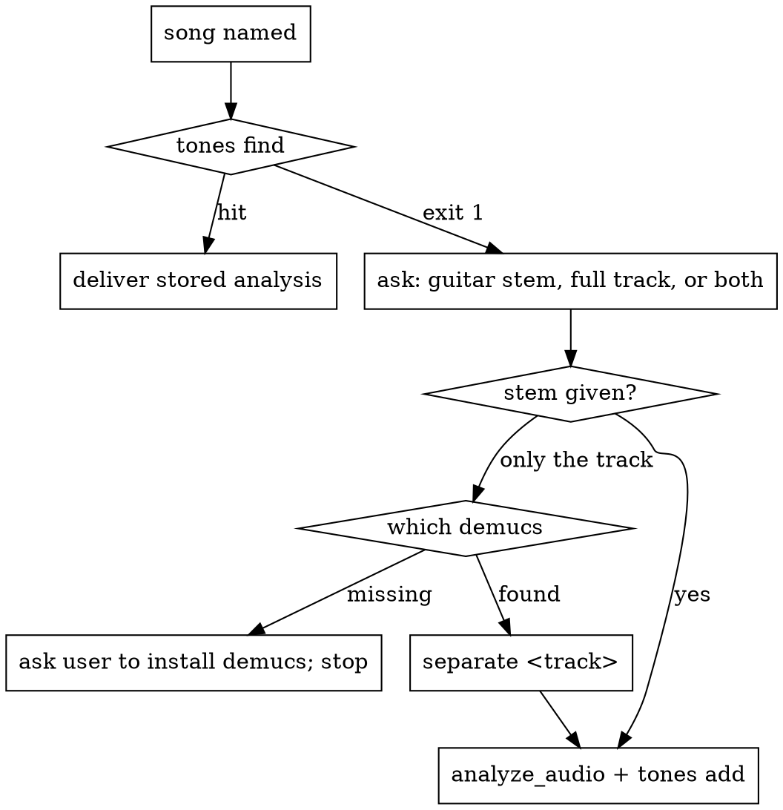

# tone-analyzer

Extracts information from **one** audio: metrics (JSON), documentation (PDF)
and spectrum (PNG). Never touches anything outside `--out-dir`.

## Iron rules

0. **One audio in, information out.** Anything that compares two audios or
   decides pass/fail (render × reference, accept a take, EQ loop, retention)
   belongs to **tone-builder**. `compare`, `eq-match` and `correction-ir` are **obsolete**.
1. **No side effects outside `--out-dir`**, with two exceptions: `tones add`
   writes the song library (`~/.tone-analyzer/tones/` by default), and `separate`
   lets demucs download its model. No MCP calls, no rig edits, no project writes.
2. **No name claims from audio.** Never "it sounds like a Mesa". `gain_character`
   is a four-bucket enum, not a model name.
3. **No playing-technique claims** ("palm-muted", "sweep-picked"…). Describe only
   what the analyzer reports, with the chain explicit ("crest 15 dB ⇒ gaps").
4. **Heuristic section labels only** (`tone_profile + dynamics_profile + presence`),
   never verse/chorus/solo.
5. **English in code, comments, JSON, summaries.** Chat stays in the user's language.

## Setup

```bash
which ffmpeg && python3 --version          # ffmpeg for non-PCM decode; python ≥ 3.11
"${CLAUDE_PLUGIN_ROOT}/bootstrap.sh"       # idempotent venv at ${CLAUDE_PLUGIN_ROOT}/.venv
TA="${CLAUDE_PLUGIN_ROOT}/.venv/bin/tone-analyzer"
```

## A song is asked for — library first



1. **`"$TA" tones find <song> [<artist>]`** searches `$TONE_ANALYZER_TONES_PATH`, then
   `~/.tone-analyzer/tones`, then the library shipped in this repo. Hit → summarize the
   stored `<role>/fingerprint.json` and show its PNGs; **no audio is asked for**. Several
   hits → ask which. The user wants it redone with new audio → continue at 2.
2. **Miss → ask for the audio**: an isolated guitar stem, the full track, or both.
3. **Only the full track** → `which demucs`. Missing → tell the user to run
   `pipx install demucs` and stop until they do; never install it yourself. Present →
   `"$TA" separate <track> --out-dir DIR` → `DIR/guitar.wav` (48 kHz).
4. **Analyze and store in one step**:
   ```bash
   "$TA" analyze <stem> --out-dir A
   # full track available: harmonics of the stem's notes, read ON THE TRACK
   "$TA" harmonics <track> --out-dir A $(jq -r '.notes[]|"--at \(.start_s) --midi \(.midi)"' A/fingerprint.json)
   "$TA" tones add --artist "<Artist>" --song "<Song>" --role lead|rhythm|… --analysis A \
       --reference-kind stem|separated|track --reference <stem> [--track <track>] \
       [--separator "demucs htdemucs_6s"]
   ```
   `--reference-kind`: `stem` = the user gave an isolated guitar; `separated` = you ran
   `separate`; `track` = only the mix exists (the numbers include the whole band — say so).
5. Tell the user where it was saved, and that copying the entry folder into this repo's
   `tones/` shares it. Do not open a PR.

**Stems locate, the track measures.** Separation erases harmonics above ~H6 (disc +21 dB
over the neighbourhood where the stem reads −104 dB). Notes and attack times come from
the stem; harmonic *levels* come from `harmonics.json` read on the track. Without a
track, say that the harmonic levels are from a stem.

**Analyzer changed?** `"$TA" tones reanalyze <song>` (or `--all`) re-runs every stored role
from its stored audio (`<role>/reference.*`, `track.*`).

## Commands

| need | command | output in `--out-dir` |
|---|---|---|
| everything about one audio | `"$TA" analyze <in.wav>` | `fingerprint.json`, `analysis.pdf`, `spec_*.png` |
| harmonics H1..H16 of a note at a **given** attack time — e.g. reading a full mix where the note was located elsewhere | `"$TA" harmonics <in.wav> --at SEC --midi M [--at SEC --midi M …]` | `harmonics.json` |
| harmonics of the notes **detected** in this audio | `"$TA" harmonics <in.wav> --auto` | `harmonics.json` |
| one recorded note/take: pitch, onset, duration, saturation, noise floor | `"$TA" take <in.wav>` | `take.json` |
| guitar out of a full mix (needs `demucs` on PATH, exit 3 if missing) | `"$TA" separate <track>` | `guitar.wav`, `no_guitar.wav` (48 kHz), `separate.json` |
| song library | `"$TA" tones find <song>` · `tones list` · `tones add …` · `tones reanalyze <song>\|--all` | library root |

All accept `--out-dir DIR` (default `/tmp/tone-analyzer/<unix_ts>/`) and print it on
the last line. Files > 600 s are rejected — ask the user to trim.

## What the numbers are

- **Pitch** — plain autocorrelation at 48 kHz, no octave post-processing (every
  octave "correction" tried measured worse). Scores 93/96 on real recorded guitar
  notes; misses are octave errors — report them, don't patch them.
- **Harmonic** `k` — `level_db` = peak power in `k·f0·(1 ± 0.012)`;
  `neighbour_db` = median in `k·f0·[0.90, 0.96] ∪ [1.04, 1.10]`;
  `prominence_db` = level − neighbour; `relative_db` = level − H1. Window: 0.6 s
  from the attack. `None` above 0.9 · Nyquist. `--at` is used **exactly as given** —
  it is not snapped to a nearby attack, so pass the real attack time.
- **Saturation** — `saturated_samples` = number of samples with |x| > 0.999, **summed over
  all channels**: a sample that clips on any one channel counts.
  `global.peak_db` is a mono mixdown and halves a one-sided clip: never use it to
  say a file did not clip.
- **Noise floor / SNR** (`take`) — RMS before the attack vs RMS of the 0.6 s note.
  `None` when less than 10 ms precedes the attack.

## Output schemas

- `fingerprint.json` (**schema 4**): `source`, `global` (`lufs_integrated`, `peak_db`,
  `saturated_samples`, `stereo`), `sections[]` (`loudness`, `spectrum`, `distortion`,
  `time_fx`, `labels`), **`notes[]`** (`start_s`, `midi`, `name`, `f0_hz`, `level_db[16]`,
  `neighbour_db[16]`, `prominence_db[16]`, `relative_db[16]`).
- `analysis.pdf`: cover, full-track spectrogram, one page per section, **Notes** page
  (harmonic bars per detected note).
- `spec_global.png`, `spec_section_*.png`, **`spec_notes.png`** (attacks and note names
  marked). Read the PNGs with the Read tool — they are evidence.
- `harmonics.json` (schema 1): `source`, `notes[]` as above.
- `take.json`: `duration_s`, `onset_s`, `midi`, `name`, `f0_hz`, `pitch_confidence`,
  `saturated_samples`, `peak_db`, `noise_floor_db`, `signal_db`, `snr_db`. **No verdict** —
  accepting the take is tone-builder's decision.

## Obsolete: `compare`, `eq-match`, `correction-ir`

They compare two audios, which is tone-builder's job, and they are invalid for single
notes: they average 1/3-octave bands, and on one note those bands alternate harmonic
peaks and valleys 74–84 dB down. Running them prints a warning. Asked to compare a
render with a reference? Use **tone-builder**.

## Summarizing in chat

- **analyze**: one short paragraph per section (gain character, dynamics, presence,
  time-FX), then the detected notes with their strongest and weakest harmonics.
- **harmonics / take**: the numbers, with the definitions above. No judgement about
  whether they are "good".

## Anti-patterns

- ❌ Using `compare`/`eq-match`/`correction-ir` to judge or correct a tone. → tone-builder.
- ❌ Saying a file did not clip because `peak_db` < 0. → read `saturated_samples`.
- ❌ "Fixing" an octave error with a heuristic. → report the pitch as measured.
- ❌ Deciding a take is good or bad here. → report metrics; tone-builder decides.
- ❌ Asking for audio before `tones find`. → the song may already be analyzed.
- ❌ Analyzing a full band mix as if it were the guitar. → `separate` first, or store it as `--reference-kind track` and say so.
- ❌ Installing demucs (pip, pipx, brew) yourself. → ask the user.
- ❌ Reading harmonic levels on a stem when the track exists. → `harmonics <track> --at … --midi …`.
- ❌ Writing anywhere outside `--out-dir` and the library; calling rig/MCP tools; naming gear from audio.
